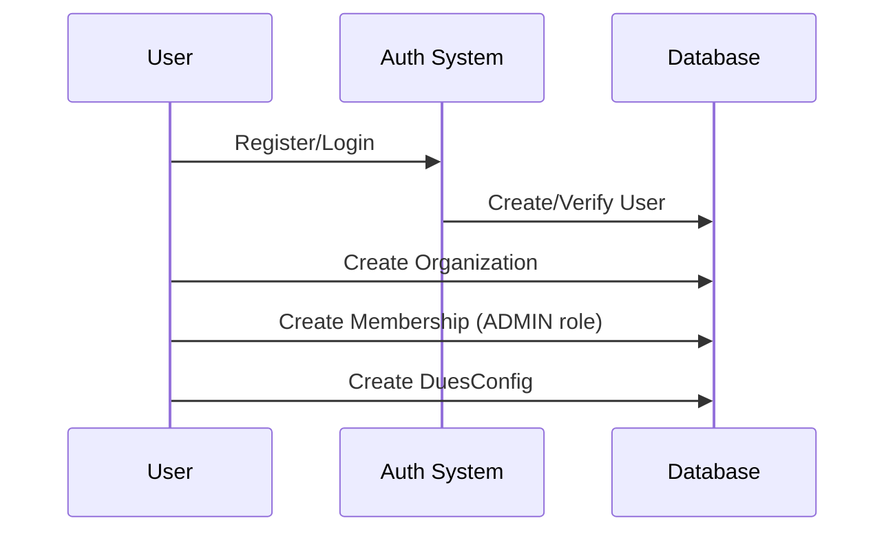
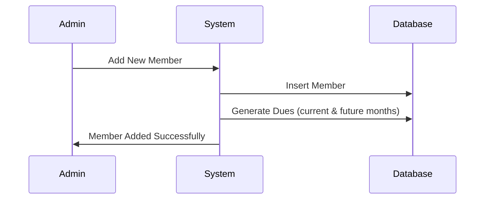
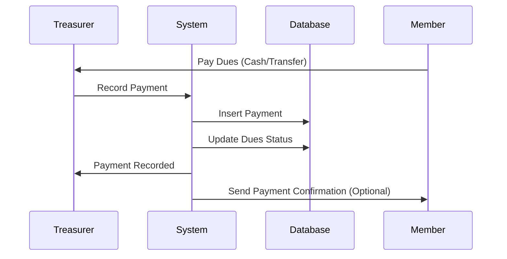
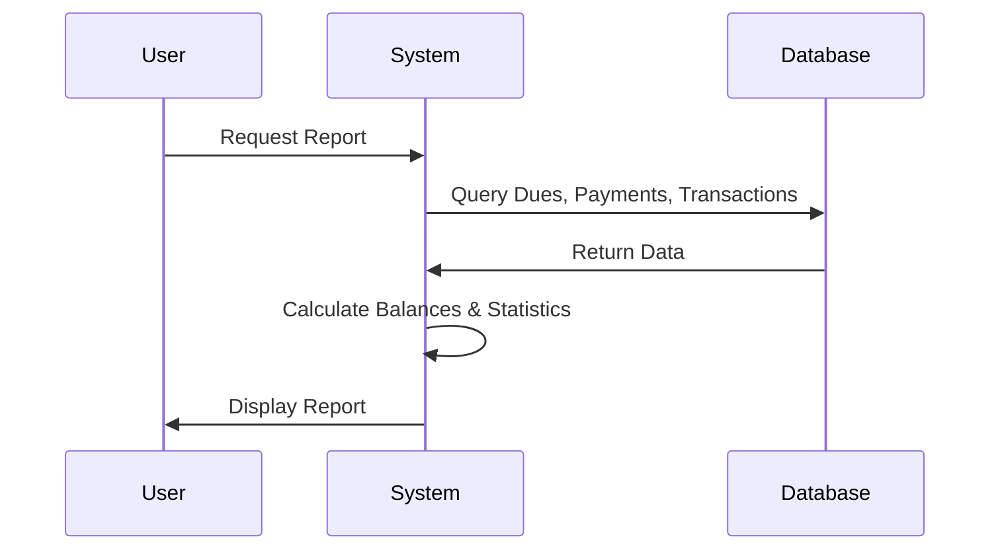
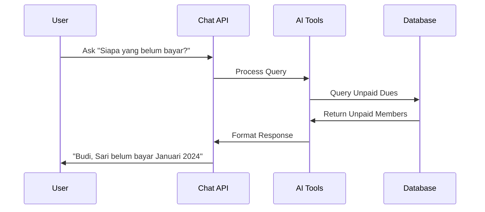

# Database Documentation - Sistem Kas

## Overview
Sistem Kas adalah aplikasi manajemen iuran berbasis web yang memungkinkan organisasi untuk mengelola anggota, iuran, dan pembayaran. Aplikasi ini menggunakan PostgreSQL sebagai database dan Prisma sebagai ORM.

## Database Schema

### 1. User Management Tables

#### User
Tabel untuk menyimpan data pengguna aplikasi (admin/treasurer yang mengelola sistem).

```prisma
model User {
  id            String         @id @default(cuid())
  email         String         @unique
  name          String?
  image         String?
  emailVerified DateTime?
  createdAt     DateTime       @default(now())
  updatedAt     DateTime       @updatedAt
  accounts      Account[]
  sessions      Session[]
  memberships   Membership[]
  transactions  Transaction[]
  payments      Payment[]
}
```

**Fungsi**: Menyimpan data pengguna yang dapat login ke sistem untuk mengelola organisasi.

**Contoh Data**:
```json
{
  "id": "user123",
  "email": "admin@rt01.com",
  "name": "Admin RT 01",
  "emailVerified": "2024-01-15T10:00:00Z"
}
```

#### Organization
Tabel untuk menyimpan data organisasi/komunitas.

```prisma
model Organization {
  id            String        @id @default(cuid())
  name          String
  createdAt     DateTime      @default(now())
  updatedAt     DateTime      @updatedAt
  memberships   Membership[]
  members       Member[]
  duesConfigs   DuesConfig[]
  transactions  Transaction[]
  dues          Dues[]
}
```

**Fungsi**: Menyimpan data organisasi seperti RT, RW, komunitas, atau kelompok yang memiliki sistem iuran.

**Contoh Data**:
```json
{
  "id": "org123",
  "name": "Kas RT 01",
  "createdAt": "2024-01-01T00:00:00Z"
}
```

#### Membership
Tabel penghubung antara User dan Organization dengan role-based access.

```prisma
model Membership {
  id              String        @id @default(cuid())
  userId          String
  organizationId  String
  role            Role          @default(VIEWER)
  createdAt       DateTime      @default(now())
  updatedAt       DateTime      @updatedAt
  user            User          @relation(fields: [userId], references: [id])
  organization    Organization  @relation(fields: [organizationId], references: [id])

  @@unique([userId, organizationId])
}

enum Role {
  ADMIN
  TREASURER
  VIEWER
}
```

**Fungsi**: Mengatur siapa yang bisa mengakses data organisasi dan dengan hak akses apa.
- **ADMIN**: Akses penuh (CRUD semua data)
- **TREASURER**: Mengelola pembayaran dan transaksi
- **VIEWER**: Hanya melihat laporan

**Contoh Data**:
```json
{
  "userId": "user123",
  "organizationId": "org123",
  "role": "ADMIN"
}
```

### 2. Member Management Tables

#### Member
Tabel untuk menyimpan data anggota yang wajib membayar iuran.

```prisma
model Member {
  id            String        @id @default(cuid())
  organizationId String
  fullName      String
  email         String?
  phone         String?
  joinedAt      DateTime      @default(now())
  isActive      Boolean       @default(true)
  dues          Dues[]
  payments      Payment[]
  notes         String?
  organization  Organization  @relation(fields: [organizationId], references: [id])
}
```

**Fungsi**: Menyimpan data anggota kas yang wajib membayar iuran bulanan.

**Contoh Data**:
```json
{
  "id": "member123",
  "organizationId": "org123",
  "fullName": "Budi Santoso",
  "email": "budi@email.com",
  "phone": "081234567890",
  "isActive": true,
  "notes": "Rumah nomor 15"
}
```

### 3. Dues Management Tables

#### DuesConfig
Tabel konfigurasi iuran untuk setiap organisasi.

```prisma
model DuesConfig {
  id            String        @id @default(cuid())
  organizationId String
  amount        Int           // default dues amount
  currency      String        @default("IDR")
  createdAt     DateTime      @default(now())
  updatedAt     DateTime      @updatedAt
  organization  Organization  @relation(fields: [organizationId], references: [id])
}
```

**Fungsi**: Menyimpan konfigurasi besaran iuran default untuk organisasi.

**Contoh Data**:
```json
{
  "organizationId": "org123",
  "amount": 50000,
  "currency": "IDR"
}
```

#### Dues
Tabel untuk menyimpan data iuran bulanan setiap anggota.

```prisma
model Dues {
  id            String    @id @default(cuid())
  organizationId String
  month         Int
  year          Int
  amount        Int
  memberId      String
  member        Member    @relation(fields: [memberId], references: [id])
  status        DuesStatus @default(PENDING)
  createdAt     DateTime  @default(now())
  updatedAt     DateTime  @updatedAt
  payments      Payment[]
  organization  Organization @relation("OrganizationDues", fields: [organizationId], references: [id])

  @@unique([memberId, month, year])
}

enum DuesStatus {
  PENDING   // Belum dibayar
  PARTIAL   // Dibayar sebagian
  PAID      // Lunas
}
```

**Fungsi**: Menyimpan data iuran bulanan untuk setiap anggota dengan status pembayaran.

**Contoh Data**:
```json
{
  "memberId": "member123",
  "month": 1,
  "year": 2024,
  "amount": 50000,
  "status": "PENDING"
}
```

### 4. Payment Management Tables

#### Payment
Tabel untuk menyimpan data pembayaran iuran.

```prisma
model Payment {
  id            String    @id @default(cuid())
  duesId        String
  dues          Dues      @relation(fields: [duesId], references: [id])
  memberId      String
  member        Member    @relation(fields: [memberId], references: [id])
  paidAt        DateTime  @default(now())
  amount        Int
  method        String?
  note          String?
  createdById   String?
  createdBy     User?     @relation(fields: [createdById], references: [id])
}
```

**Fungsi**: Menyimpan riwayat pembayaran iuran oleh anggota.

**Contoh Data**:
```json
{
  "duesId": "dues123",
  "memberId": "member123",
  "amount": 50000,
  "method": "Transfer Bank",
  "paidAt": "2024-01-15T14:30:00Z",
  "createdById": "user123"
}
```

### 5. Transaction Management Tables

#### Transaction
Tabel untuk menyimpan transaksi keuangan organisasi (pemasukan/pengeluaran).

```prisma
model Transaction {
  id            String    @id @default(cuid())
  organizationId String
  type          TxType
  amount        Int
  category      String?
  occurredAt    DateTime  @default(now())
  note          String?
  createdById   String?
  createdBy     User?     @relation(fields: [createdById], references: [id])
  createdAt     DateTime  @default(now())
  updatedAt     DateTime  @updatedAt
  organization  Organization @relation(fields: [organizationId], references: [id])
}

enum TxType {
  INCOME    // Pemasukan
  EXPENSE   // Pengeluaran
}
```

**Fungsi**: Menyimpan catatan keuangan organisasi selain dari iuran anggota.

**Contoh Data**:
```json
{
  "organizationId": "org123",
  "type": "EXPENSE",
  "amount": 200000,
  "category": "Kebersihan",
  "note": "Beli alat kebersihan",
  "occurredAt": "2024-01-20T09:00:00Z"
}
```

### 6. Authentication Tables (NextAuth)

#### Account & Session
Tabel untuk autentikasi menggunakan NextAuth.js.

```prisma
model Account {
  id                String  @id @default(cuid())
  userId            String
  type              String
  provider          String
  providerAccountId String
  refresh_token     String?
  access_token      String?
  expires_at        Int?
  token_type        String?
  scope             String?
  id_token          String?
  session_state     String?
  user              User    @relation(fields: [userId], references: [id])

  @@unique([provider, providerAccountId])
}

model Session {
  id           String   @id @default(cuid())
  sessionToken String   @unique
  userId       String
  expires      DateTime
  user         User     @relation(fields: [userId], references: [id])
}
```

## Relasi Antar Tabel

### 1. User ↔ Organization (Many-to-Many)
- Melalui tabel `Membership`
- Satu user bisa mengelola beberapa organisasi
- Satu organisasi bisa dikelola beberapa user dengan role berbeda

### 2. Organization ↔ Member (One-to-Many)
- Satu organisasi memiliki banyak anggota
- Satu anggota hanya terdaftar di satu organisasi

### 3. Member ↔ Dues (One-to-Many)
- Satu anggota memiliki banyak iuran (per bulan/tahun)
- Satu iuran hanya milik satu anggota

### 4. Dues ↔ Payment (One-to-Many)
- Satu iuran bisa dibayar beberapa kali (cicilan)
- Satu pembayaran hanya untuk satu iuran

### 5. User ↔ Payment (One-to-Many)
- Satu user (admin/treasurer) bisa mencatat banyak pembayaran
- Satu pembayaran dicatat oleh satu user

## Application Flow

### 1. User Registration & Organization Setup


### 2. Member Management Flow


### 3. Payment Processing Flow


### 4. Reporting Flow


### 5. AI Chat Integration Flow


## Key Business Rules

### 1. Dues Generation
- Iuran dibuat otomatis setiap bulan untuk semua anggota aktif
- Status default: `PENDING`
- Amount diambil dari `DuesConfig`

### 2. Payment Rules
- Pembayaran bisa dilakukan sebagian (cicilan)
- Status dues berubah: `PENDING` → `PARTIAL` → `PAID`
- Total pembayaran tidak boleh melebihi jumlah iuran

### 3. Access Control
- **ADMIN**: Full access ke semua fitur
- **TREASURER**: Mengelola pembayaran dan transaksi
- **VIEWER**: Hanya melihat laporan

### 4. Data Integrity
- Satu anggota hanya bisa punya satu iuran per bulan/tahun
- User hanya bisa akses organisasi sesuai membership
- Soft delete untuk anggota (isActive = false)

## Example Queries

### 1. Cek Anggota Belum Bayar
```sql
SELECT m.fullName, d.month, d.year, d.amount
FROM Member m
JOIN Dues d ON m.id = d.memberId
WHERE d.organizationId = 'org123'
  AND d.status = 'PENDING'
  AND d.year = 2024
  AND d.month = 1;
```

### 2. Total Saldo Organisasi
```sql
-- Total Pemasukan dari Iuran
SELECT SUM(p.amount) as total_dues_income
FROM Payment p
JOIN Dues d ON p.duesId = d.id
WHERE d.organizationId = 'org123';

-- Total Transaksi
SELECT 
  SUM(CASE WHEN type = 'INCOME' THEN amount ELSE 0 END) as income,
  SUM(CASE WHEN type = 'EXPENSE' THEN amount ELSE 0 END) as expense
FROM Transaction
WHERE organizationId = 'org123';
```

### 3. Laporan Tunggakan
```sql
SELECT 
  m.fullName,
  COUNT(d.id) as unpaid_months,
  SUM(d.amount) as total_arrears
FROM Member m
JOIN Dues d ON m.id = d.memberId
WHERE d.organizationId = 'org123'
  AND d.status IN ('PENDING', 'PARTIAL')
GROUP BY m.id, m.fullName
ORDER BY total_arrears DESC;
```

## Migration Strategy

Untuk setup database baru:

1. **Run Migrations**:
   ```bash
   npx prisma migrate dev --name init
   ```

2. **Seed Data**:
   ```bash
   npx prisma db seed
   ```

3. **Generate Client**:
   ```bash
   npx prisma generate
   ```

Data seed akan membuat:
- 3 organisasi contoh
- 1 user test dengan membership
- 5 anggota per organisasi
- Iuran 6 bulan terakhir
- Beberapa pembayaran sample

## Performance Considerations

### Indexes
- `Member.organizationId` - untuk query per organisasi
- `Dues.memberId, month, year` - unique constraint & fast lookup
- `Payment.duesId` - untuk agregasi pembayaran
- `Membership.userId, organizationId` - untuk authorization

### Query Optimization
- Gunakan `include` untuk eager loading relasi
- Implementasi pagination untuk list data besar
- Cache hasil query yang sering diakses
- Gunakan `select` untuk membatasi field yang diambil

Dokumentasi ini memberikan gambaran lengkap tentang struktur database dan flow aplikasi sistem kas. Untuk pertanyaan lebih lanjut, silakan merujuk ke kode sumber atau hubungi tim development.